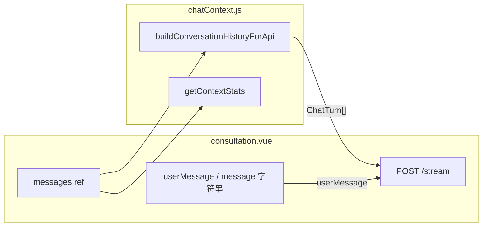

# chatContext 在 consultation 中的用法与参数说明

## 1. 文件与导入关系

实际工具文件为 [`src/utils/chatContext.js`](../src/utils/chatContext.js)。在 [`src/views/consultation.vue`](../src/views/consultation.vue) 中只使用了其中三项（另两项常量为环境变量兜底）：

```javascript
import {
    buildConversationHistoryForApi,
    DEFAULT_MAX_CONTEXT_CHARS,
    DEFAULT_MAX_CONTEXT_PAIRS,
    getContextStats,
} from '@/utils/chatContext';
```

- **`buildConversationHistoryForApi`**：在发起流式请求前，从当前 `messages` 数组生成发给后端的「历史轮次」`conversationHistory`（受 `VITE_CHAT_SEND_HISTORY` 控制是否带上）。
- **`getContextStats`**：根据当前 `messages` 计算条数、字数等，供界面展示上下文体量。
- **`DEFAULT_MAX_CONTEXT_*`**：当环境变量未配置时，作为 `MAX_CONTEXT_PAIRS` / `MAX_CONTEXT_CHARS` 的默认值（见 consultation 第 19–21 行）。

未在 consultation 中直接调用的导出：`toChatTurns`、`buildHistoryBeforeCurrent`、`truncateTurns`、`truncateByChars` —— 它们由 `buildConversationHistoryForApi` / `getContextStats` **内部组合使用**。

---

## 2. `messages`：为何能「拿到所有对话信息」

页面用 **`messages`**（复数）作为 **`ref([])`** 保存**整条会话里每一条气泡**（用户 / AI），包括 `id`、`senderType`、`content`、`createAt` 等：

```javascript
// 定义对话消息
const messages = ref([])
```

- **切换会话**：`handleSessionClick` 里 `messages.value = res`，整列表替换为后端详情。
- **发消息**：先 `push` 用户一条，再 `startAiresponse`；在 `startAiresponse` 里再 `push` 一条空的 AI 气泡。
- **列表渲染**：模板里 `v-for="msg in messages"`，所以界面展示的正是这一数组的完整内容。

因此：**「所有对话信息」来自同一个响应式数组 `messages`，而不是某个叫 `message` 的变量。**

---

## 3. `message`（单数）在 consultation 里指什么

这里容易混淆，文件里 **`message` 多数是「当前这一句用户输入」的字符串**，不是历史列表：

| 位置 | 含义 |
|------|------|
| `sendMessage` 里 `const message = userMessage.value.trim()` | 本次发送的**用户文本** |
| `startNewSession(message)` / `startAiresponse(sessionId, message)` 的第二个参数 `userMessage` | 同上，传给建会话或流式接口的**当前用户句** |

这些**不包含**完整历史；完整历史通过下面的 `buildConversationHistoryForApi(messages.value, …)` 单独构造。

另一个易混点：**SSE 回调 `onmessage: (event) => …`** 里的 `event` 是 **服务器推送的事件**，与聊天里的 `message` 变量无关；回调里通过 `messages.value[messages.value.length - 1]` 取**最后一条 AI 气泡**做流式拼接。

---

## 4. `getContextStats`：传入参数与含义

调用：

```javascript
const contextStats = computed(() =>
    getContextStats(messages.value, { excludeTrailingEmptyAssistant: isAiTyping.value }),
)
```

| 参数 | 含义 |
|------|------|
| **`messages.value`** | 当前会话全部气泡的快照数组 |
| **`excludeTrailingEmptyAssistant`** | 为 `true` 时（AI 正在输入），若最后一条是 `senderType === 2` 且 `content` 为空，则统计时先去掉这条**占位 AI**，避免把空壳算进条数/字数 |

[`getContextStats`](../src/utils/chatContext.js) 内部会把消息转成 `ChatTurn`（见下节 `senderType` 规则），再汇总 `messageCount`、`userTurns`、`chars`、`approxTokens`。

---

## 5. `buildConversationHistoryForApi`：传入参数与含义

调用顺序（与设计注释一致：**先 push 用户，再 push 空 AI，再算历史**）：

```javascript
const startAiresponse = (sessionId, userMessage) => {
    // ...
    messages.value.push(aiMessage)

    const conversationHistory = buildConversationHistoryForApi(messages.value, {
        maxPairs: MAX_CONTEXT_PAIRS,
        maxChars: MAX_CONTEXT_CHARS,
    })
    const streamBody = {
        sessionId,
        userMessage,
        ...(SEND_CONVERSATION_HISTORY ? { conversationHistory } : {}),
    }
```

| 参数 | 含义 |
|------|------|
| **`messages.value`（第一个参数）** | 必须在**已 push 当前用户句 + 已 push 占位 AI 空气泡**之后传入；工具内用 `slice(0, -2)` 去掉这最后两条，得到**此前已完成轮次**作为历史，避免把「当前用户句」和「尚未填完的 AI」重复送进历史。 |
| **`options.maxPairs`** | 最多保留最近多少对「用户 + 助手」轮次（内部 `truncateTurns`）。 |
| **`options.maxChars`** | 在上述轮次基础上再按总字符数从尾部裁剪（内部 `truncateByChars`）。 |

单条消息如何变成 API 用的 `ChatTurn`（[`toChatTurns`](../src/utils/chatContext.js)）：

- **`senderType === 1`** → `role: 'user'`
- **否则** → `role: 'assistant'`
- **`content`** 去空白；空内容条目不进入 `turns`

仅当 `VITE_CHAT_SEND_HISTORY === 'true'` 时，`streamBody` 才会带上 `conversationHistory`；否则后端只收到 `sessionId` + `userMessage`（依赖服务端 Session 自有记忆）。

---

## 6. 数据流小结（mermaid）



---

## 7. 直接回答「为什么 message 能拿到所有对话信息」

- 若指 **`message`（单数）**：它**不能**拿到所有对话信息，它只是**当前输入的那一句**。
- 若指 **界面上的整条会话**：靠的是 **`messages` 数组** 自始至终累积（或从 `getSessionDetail` 一次性赋值），`chatContext` 只是把这份数组转成统计信息或裁剪后的历史再给 API。
- 若指 **流式回调里更新 AI 气泡**：用的是 **`messages.value[messages.value.length - 1]`**，只是**指向最后一条**，通过 **同一个 `messages` 数组的引用** 改 `content`，并不是单独变量「持有」全部对话。
